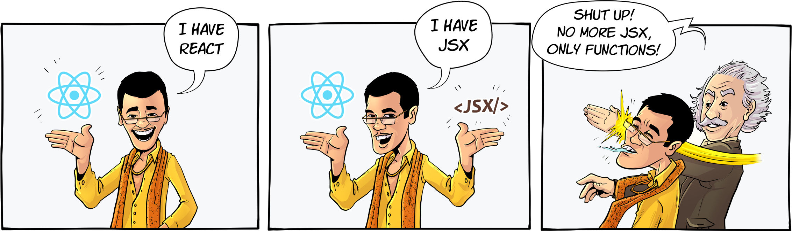
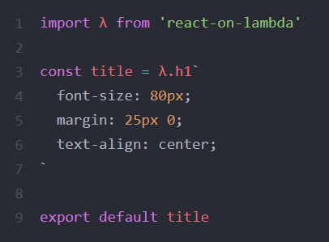

<div align="center">
  
  <br/>
  <br/>
  <br/>
  
</div>
<br/>
<br/>

# React on lambda

[](https://travis-ci.org/sultan99/react-on-lambda)
[](https://coveralls.io/github/sultan99/react-on-lambda?branch=master)
[](https://unpkg.com/react-on-lambda@0.0.7/dist/react-on-lambda.min.js)
[](https://github.com/sultan99/react-on-lambda/blob/master/LICENSE)

> A tiny library which makes easy to use [React](https://github.com/facebook/react) without JSX.

<br/>

JSX has simple, declarative and html-like syntax, nice extension to ECMAScript.
Unfortunately, despite these cool features you deal with text.
Most of time you find yourself doing js code inside html, and inside that html you make again another js code and so on.
In order to reuse some jsx fragments you have to wrap them by functions. Then you may come to the main question:

#### Why not just use functions instead of jsx strings?

And get all benefits of functional programming:
 - splitting code into more reusable parts
 - curry and function composition
 - easier testing & debugging
 - compact and clean code
<br/>

## Features
- fun functional programming
- less & clean coding
- no [babel](https://babeljs.io/), no JSX
- minimal size (~1kb)
<br/>

## Examples
You can find a whole application example [here](https://github.com/sultan99/rol-usage).

Read more info about symbol `λ` in the section: [editor configuration](#editor-configuration).
```js
import λ from 'react-on-lambda' // or import l from 'react-on-lambda'
import {render} from 'react-dom'

const postLink = λ.a({href: `/posts/123`})

const title = λ.compose(
  λ.h1({class: `post-title`}), // or λ.h1({className: `post-title`})
  postLink
)

const post = λ.div(
  title(`How to use react on lambda?`),
  λ.p(`
    Lorem ipsum dolor sit amet,
    Ernestina Urbanski consectetur adipiscing elit.
    Ut blandit viverra diam luctus luctus...
  `),
  postLink(`Read more`)
)

render(
  post,
  document.getElementById(`app`)
)
```
<br/>

## Getting started
The primary you will need to install the `react-on-lambda` with `react`":

```sh
$ npm i react-on-lambda react -S
```

optionally you can to install `styled-components` if you are going to use it:

```sh
$ npm i styled-components -S
```
<br/>

## API documentation
Full documentation will be provided later, at this moment some snippets.

**Styling**
```js
import λ from 'react-on-lambda'

const header = λ.h1`
  color: #ff813f;
  font-size: 22px;
`

const onClick = () => alert(`Hi!`)

const app = λ.div(
  header(`Welcome to React on λamda!`),
  λ.button({onClick}, `OK`)
)

export default app
```
<br/>

**Function showIf**
```js
const app = props => λ.div(
  λ.showIf(!props.isLoading,
    λ.h1(`Welcome to React on λambda!`),
    λ.span(`Please wait, page is loading...`)
  )
)
```
<br/>

**Function mapKey**
```js
const pages = [`Home page`, `Portfolio`, `About`]

λ.ul(
  λ.mapKey(λ.ul, pages)
)

// jsx equivalent
<ul>
  {pages.map((item, key) = >
    <li key={key}>
      {item}
    </li>
  )}
</ul>
```
<br/>

**Composition of pluck and mapKey**
```js
const data = [
  {id: 123, name: `foo`},
  {id: 124, name: `bar`},
]

const userList = λ.compose(
  λ.div,
  λ.ul,
  λ.mapKey(λ.li),
  λ.pluck(`name`, `id`)
)

userList(data)

// jsx equivalent
<div>
  <ul>
    {data.map(user = >
      <li key={user.id}>
        {user.name}
      </li>
    )}
  </ul>
</div>
```
<br/>

## Editor configuration
> Code highlighting in Atom


<br/>

Personally I hate to use symbols `$` `_` it makes code look dirty and reminds me [Perl](https://regmedia.co.uk/2017/10/31/perl_code_example.png) or regular expression.
I prefer to use Greek letter `λ` – short and meaningful.

Of course you can use any identifier at your own choice:
```js
import l from 'react-on-lambda'
// or 
import {div, h1} from 'react-on-lambda'

```

But if you liked `λ` you can setup hot key and CSS syntax highlighting following the instructions bellow:
- [Github Atom](./assets/atom.md)
- Microsoft VS Code (will be provided)

<br/>
<br/>

## Support
<a href="https://www.buymeacoffee.com/KGEzqayNQ" target="_blank">
  
</a>
